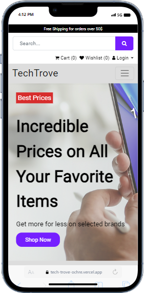

# ALX Portfolio Project - E-Commerce Website
The ALX Portfolio Frontend is the frontend component of an electronic shopping website, showcasing items such as drones, laptops, cameras, and headphones.

## Introduction
The ALX Portfolio project aims to create a dynamic electronic shopping website. This README.md provides essential information about the frontend component.

## Deployed Site: [TechTrove](https://tech-trove-ochre.vercel.app/#)
- Final Project Blog Article: [Link to Final Project Blog Article](https://www.linkedin.com/)
- Author's LinkedIn: [Amadi-Sheriff Delight](https://www.linkedin.com/in/delightsheriff/)

## Installation
To run this frontend locally, follow these steps:

- Clone the repository: git clone [frontend repository URL](https://github.com/Delightsheriff/TechTrove/)
- Navigate to the frontend directory: cd [frontend directory

## Usage
The ALX Portfolio Frontend provides a user-friendly interface to browse and explore the electronic shopping website. Follow the installation steps and open the site in your browser to start exploring.

## Contributing
Contributions to the frontend are welcome! If you have ideas for improvements or new features, follow these steps:
- Fork the repository
- Create a new branch: git checkout -b feature/new-feature
- Make your changes and commit them: git commit -m 'Add new feature'
- Push to the branch: git push origin feature/new-feature
- Submit a pull request

Fork the repository
Create a new branch: git checkout -b feature/new-feature
Make your changes and commit them: git commit -m 'Add new feature'
Push to the branch: git push origin feature/new-feature
Submit a pull request

## Related Projects
[ALX Portfolio Backend](https://github.com/Delightsheriff/TechTrove-BackEnd)
